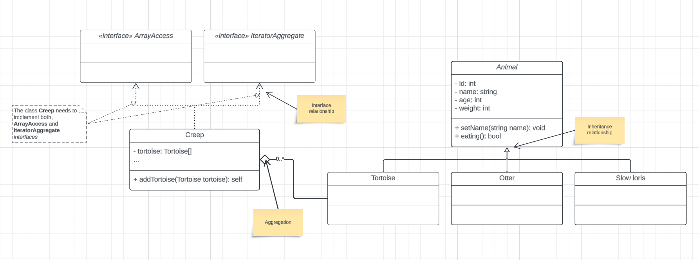

# UML - Practice 1

> **NOTE**:
>
> You should see the [screenshot](./screenshot.png) if you want to understand the `PHP` classes.

The intention of this first exercise is to become familiar with the basics of the **UML Class Diagram**. This is not an in-depth tutorial on how the **UML** standard works. Instead, it's a practice session for me to learn **UML** and incorporate it into my development process. By doing so, I hope to enhance my knowledge and skills, which, in conjunction with other experiences, will aid me in securing a project management (**PM**) position in the future. It's clear to me that achieving this goal requires more than just understanding **UML**.

## UML Screenshot

